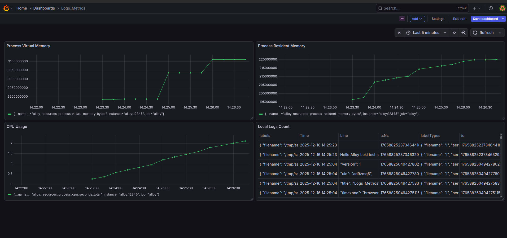

#  Static Monitoring Stack
##   Grafana Alloy • Prometheus • Loki • Grafana

A simple and static monitoring stack built with Docker Compose using **Grafana Alloy** as a unified agent for both **metrics and logs**.

This project demonstrates system monitoring, log aggregation, dashboards, and alerting in a clean, reproducible way.  
It is designed for **It is designed for learning and demos DevOps / SRE .**.

---

##  🧱 Architecture Overview
```text
Linux Host  
│  
├── Grafana Alloy  
│   ├── Collects system and process metrics  
│   └── Collects logs from local files  
│  
├── Prometheus  
│   └── Stores metrics received from Alloy  
│  
├── Loki  
│   └── Stores logs sent by Alloy  
│  
└── Grafana  
    ├── Visualizes metrics (Prometheus)  
    ├── Visualizes logs (Loki)  
    └── Dashboards and alerting UI  
```
---

##  🔧 Technologies Used

- Grafana Alloy – Unified agent for metrics and logs  
- Prometheus – Time-series metrics storage  
- Loki – Log aggregation system  
- Grafana – Dashboards and alerting  
- Docker & Docker Compose – Containerized deployment  

---

 ##  📊 What Is Monitored?

###  Metrics (via Grafana Alloy – Unix exporter)

- CPU usage  
- Memory usage  
- Process CPU & memory  
- Disk and system metrics  

> Node Exporter is **not used**.  
> Grafana Alloy replaces it completely.

---

###  Logs (via Grafana Alloy → Loki)

- Local log files mounted into the Alloy container  
- New log lines appear in Grafana almost instantly  
- Sample log files included for demonstration  

---

## 🚀 How to Run

### 1️⃣ Clone the repository

```bash
git clone <your-repository-url>
cd monitoring
```
2️⃣ Start the stack
```bash
docker compose up -d
```
3️⃣ Access services

Service	URL

Grafana	http://localhost:3000

Prometheus	http://localhost:9090

Loki	http://localhost:3100


Grafana default credentials

Username: admin

Password: admin


---

📈 Dashboards

Dashboards are exported as JSON files and stored in the repository.
They are automatically loaded using Grafana provisioning.

This ensures:

Dashboards persist after restarts

Dashboards are version-controlled

The same UI can be reproduced anywhere


---

🚨 Alerting

Alerts are defined using Prometheus alert rules.

Example alerts:

High CPU usage

High memory usage


Alerts are sent to Alertmanager, which can forward notifications to:

Email

Telegram

Slack


---


Grafana dashboard showing metrics and logs collected by Grafana Alloy.

Below is an example Grafana dashboard showing:

Process CPU usage

Process memory (virtual and resident)

Logs collected from local files via Loki





---

🤔 Why Grafana Alloy?

Replaces multiple agents (Node Exporter, Promtail, etc.)

Single configuration for metrics and logs

Modern and officially supported by Grafana Labs

Easier to manage and extend


---

🎯 Use Cases

Learning monitoring fundamentals

DevOps / SRE interview demo project

Local monitoring lab

GitHub portfolio project


---

🧠 Author

Aylar
Computer Engineer | DevOps & Monitoring Enthusiast

